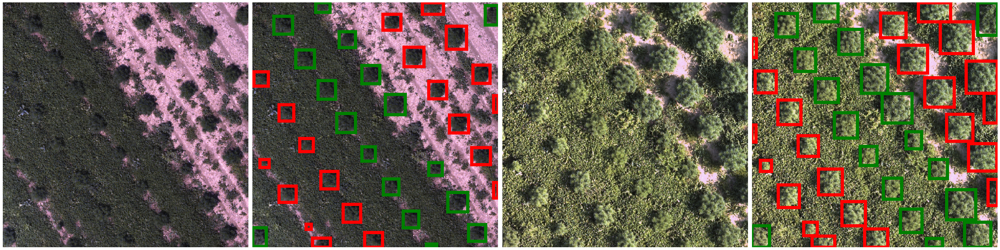
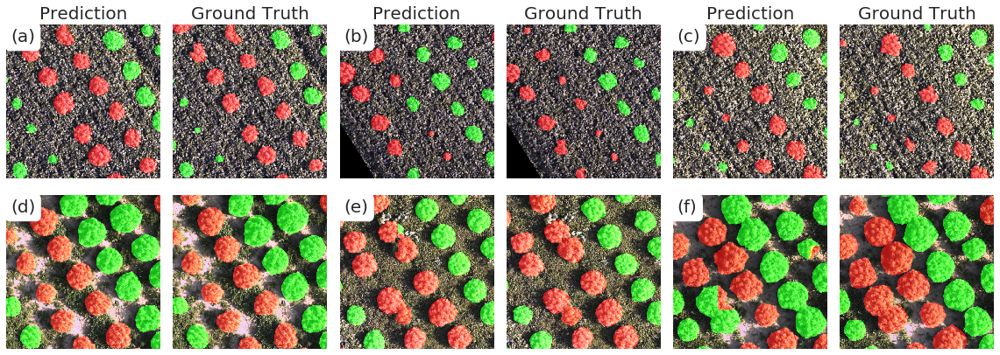

# Hemp Segmentation and Classification, a Deep Learning approach

The  yield  of  crops  such  as  hemp  (Cannabis)  depends  on  various  factors,  such  as  environmental influences,  location  site  and  lighting  conditions. Therefore,  the  task  of  quantifying the volume  and the number  of plants per unit area as well as to classify different species in the same field is critical for plant breeders to get an exact overview of the current situation in the field. For large scale sites it is almostinfeasible to manually count and estimate the volume of such fields. To automate this process, a machine learning approach, based on deep convolutional neural networks  (CNN), is proposed to generate pixel level segmentation mapsfor area and volume calculationsand to estimate the number of plants on non-overlappingcases from UAV-images.It could have been shown  that a reasonable number of training samples  already  yield  good  results.  With  post-processing steps such as majority voting which is taking shots on multiple dates into account the method delivers good results on images where it is difficult even for human individualsto labelthe plants correctly. The overall segmentation rate is above 86% measured by the dice coefficient and an accuracy of about 84.5% and higher regarding the plant counting is reported. The developed solution is therefore a robust method to segment and detect Hemp plants under real-world conditions.

Hemp Detection: Green and Red corresponds to different Species

Hemp Segmentation: Green and Red corresponds to different Species

#### Required Packages:
see: [requirements.txt](requirements.txt)
 
 # [Notebooks:](notebooks/)
 * [Hemp Segmentation](notebooks/Hemp_Segmentation.ipynb) Summary of the steps described in the documentary
 * [Multispectral_Analysis](notebooks/Multispectral_Analysis.ipynb) Analysis of multispectral images for the species classification
 
# [Utils:](utils/)
* [data interface](utils/data_interface.py) Data Interface class to load image / mask pairs from the georeferenced .tif files
* [hemp_segmentation](utils/hemp_segmentation.py) Tools for Hemp- Segmentation, including Unet code
* [evaluation](utils/utils.py) Tools for evaluation Purposes
